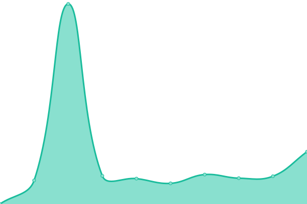

# [📈 Live Status](https://up.raznar.id): <!--live status--> **🟥 Complete outage**

This repository contains the open-source uptime monitor and status page for [Raznar Hosting](https://raznar.id/), powered by [Upptime](https://github.com/upptime/upptime).

With [Upptime](https://upptime.js.org), you can get your own unlimited and free uptime monitor and status page, powered entirely by a GitHub repository. We use [Issues](https://github.com/Raznar-Hosting/uptime-monitor/issues) as incident reports, [Actions](https://github.com/Raznar-Hosting/uptime-monitor/actions) as uptime monitors, and [Pages](https://up.raznar.id) for the status page.

<!--start: status pages-->
<!-- This summary is generated by Upptime (https://github.com/upptime/upptime) -->
<!-- Do not edit this manually, your changes will be overwritten -->
<!-- prettier-ignore -->
| URL | Status | History | Response Time | Uptime |
| --- | ------ | ------- | ------------- | ------ |
|  [Main Website](https://raznar.id) | 🟥 Down | [main-website.yml](https://github.com/Raznar-Hosting/uptime-monitor/commits/HEAD/history/main-website.yml) | 

 1993ms
     
 | 

<a href="https://up.raznar.id/history/main-website">86.23%</a>
    

|  [Game Hosting Panel](https://game.hosting.raznar.id) | 🟥 Down | [game-hosting-panel.yml](https://github.com/Raznar-Hosting/uptime-monitor/commits/HEAD/history/game-hosting-panel.yml) | 

 1660ms
     
 | 

<a href="https://up.raznar.id/history/game-hosting-panel">98.21%</a>
    

|  [App Hosting Panel](https://app.hosting.raznar.id) | 🟥 Down | [app-hosting-panel.yml](https://github.com/Raznar-Hosting/uptime-monitor/commits/HEAD/history/app-hosting-panel.yml) | 

 1814ms
     
 | 

<a href="https://up.raznar.id/history/app-hosting-panel">98.54%</a>
    

<!--end: status pages-->

[**Visit our status website →**](https://up.raznar.id)

## 📄 License

- Powered by: [Upptime](https://github.com/upptime/upptime)
- Code: [MIT](./LICENSE) © [Raznar Hosting](https://raznar.id/)
- Data in the `./history` directory: [Open Database License](https://opendatacommons.org/licenses/odbl/1-0/)
